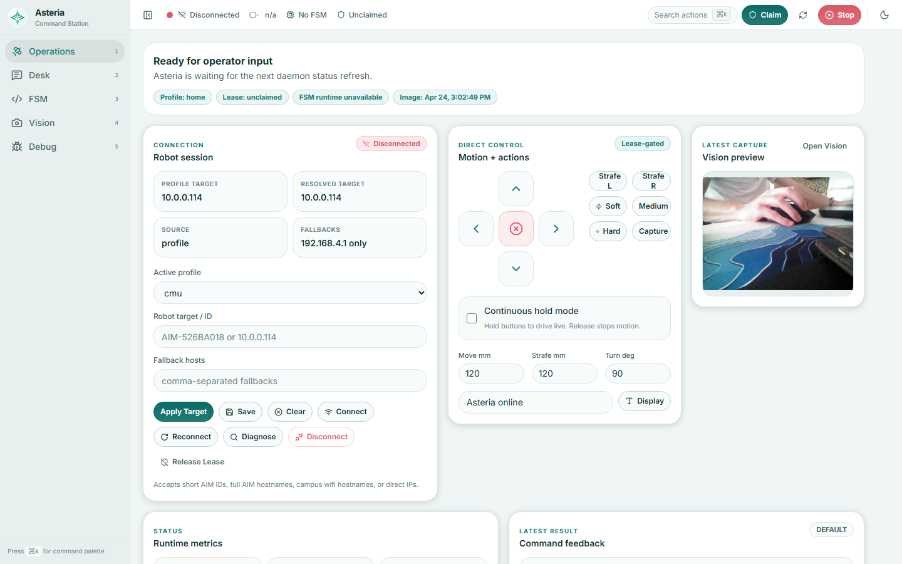

# Asteria Command Station

Asteria is a host-side command station for VEX AIM robotics work. It combines a local robot daemon, a browser control surface, a mobile bridge, curated FSM examples, and a living wiki so a human, pair-programming assistant, or autonomous agent can operate from the same source of truth.



## What It Shows

- A robotics daemon that keeps robot status, control leases, command dispatch, prompt logs, FSM files, image capture, and mobile sessions in one local runtime.
- A desktop GUI for connection management, direct motion, shared Desk prompts, FSM authoring, vision review, and debugging.
- A practical agent interface: agents can read status, claim control, write notes, resolve Desk prompts, create FSMs, compile behaviors, and stop safely.
- A teaching surface for robotics concepts such as finite state machines, leases, teleop, event injection, safety stops, and operator-agent handoff.
- A paired handheld path through [Asteria DS](https://github.com/RedLynx101/asteria-ds), which turns an old 3DS into a lightweight robot controller and prompt terminal.

## Public Repo Scope

Included:

- `asteria/daemon/` - local runtime and API server.
- `asteria/gui-app/` - React command station source.
- `asteria/gui/` - static fallback GUI.
- `asteria/mobile/` - authenticated mobile bridge used by Asteria DS.
- `asteria/tools/` - FSM helpers.
- `asteria/artifacts/fsm/` - curated example FSMs and behavior diagrams.
- `wiki/` - the Asteria operating wiki and source notes.
- `scripts/asteria_mobile_setup.py` - token/config generator for handheld clients.

Not included:

- Course labs and unrelated coursework.
- The vendored OpenClaw skill bundle.
- Local virtual environments and generated build products.
- Private generated mobile tokens, prompt logs, runtime sessions, and robot images.
- VEX AIM and AIM websocket dependency repos. Those are referenced as external runtime dependencies.

## Quick Start

The daemon and GUI can run disconnected for review, FSM editing, and agent workflow testing.

```powershell
git clone https://github.com/RedLynx101/asteria-command-station.git
cd asteria-command-station
python -m asteria.daemon.server --host 127.0.0.1
```

Open:

```text
http://127.0.0.1:8766/
```

For the modern React GUI:

```powershell
cd asteria\gui-app
npm ci
npm run build
cd ..\..
python -m asteria.daemon.server --host 127.0.0.1
```

For the CLI:

```powershell
python -m asteria.cli status
python -m asteria.cli --holder-id codex --holder-label Codex --holder-kind agent list-prompts --pending-only
```

## Pair Programmer, Agent, Classroom

Asteria is deliberately useful at three levels:

- Pair programmer: inspect the code, adjust FSM behavior, run disconnected GUI checks, and use the wiki to understand system decisions.
- Full agent: use the CLI and Desk prompt flow to claim/release control, create behaviors, compile FSMs, log notes, and report artifacts.
- Educational tool: step through how command leases, FSM compilation, mobile teleop, and stop semantics fit together in a robotics control stack.

## Live Robot Dependencies

Live VEX AIM control needs two external local dependencies. They are not needed for disconnected GUI/wiki/CLI review, but they are needed for robot connection and runtime-backed FSM execution:

- [`vex-aim-tools`](https://github.com/touretzkyds/vex-aim-tools) supplies `aim_fsm`, `genfsm`, state-machine runtime support, and robotics helpers.
- [`AIM_Websocket_Library`](https://github.com/touretzkyds/AIM_Websocket_Library) supplies the `vex` Python package and WebSocket transport for the VEX AIM robot.

Clone them into this repo root when doing live robot work:

```text
asteria-command-station/
  asteria/
  vex-aim-tools/
  AIM_Websocket_Library/
```

The optional OpenClaw gateway integration is supported through environment variables and the Asteria bridge client, but OpenClaw itself is not vendored here. See `docs/EXTERNAL_REPOS.md`.

## Wiki

Start with `wiki/index.md`. The wiki is part of the operating model: it captures validated runtime behavior, FSM conventions, safety semantics, recovery notes, and source provenance for future agents.

## Repository Pair

Use this repo with the paired public handheld client:

- [RedLynx101/asteria-ds](https://github.com/RedLynx101/asteria-ds)

Asteria DS talks to this daemon over the authenticated mobile bridge and can submit prompts, claim teleop, send motion vectors, request stops, and show low-bandwidth camera previews.
